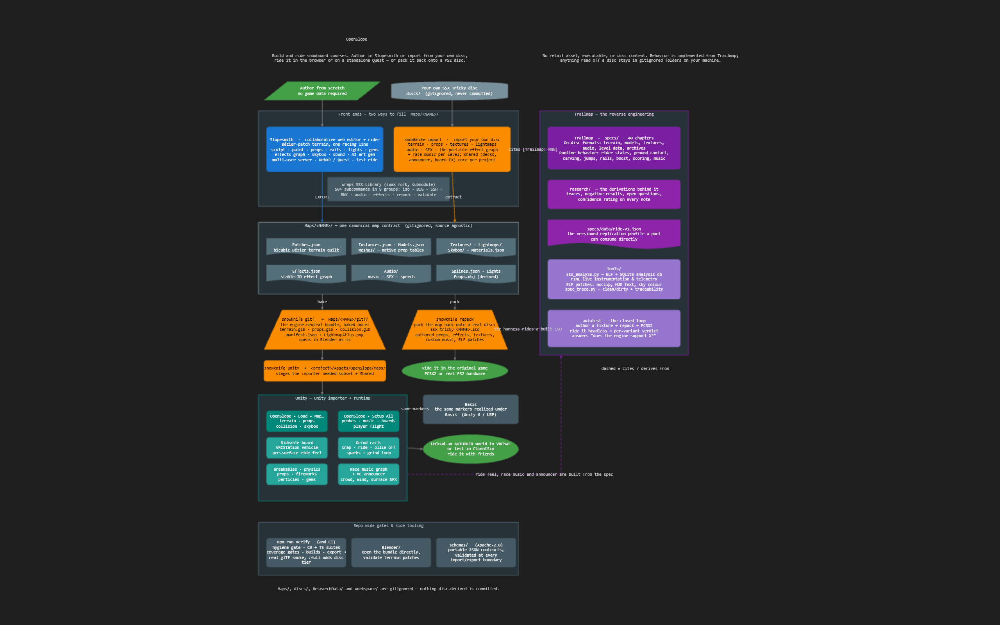
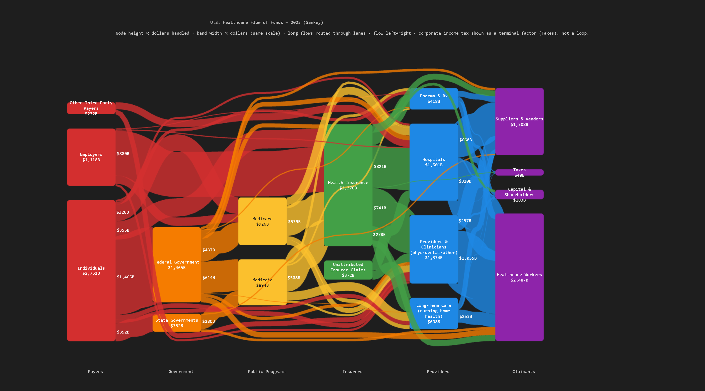

# Jumpgate

A diagramming app where the layout is data. Diagrams are plain JSON files (`.jg`) that declare where every node sits, what it looks like, and what it connects to. There is no auto-layout engine, so an AI can write the file directly: describe what you want drawn and the model places each box where it makes sense. The result checks into git, diffs cleanly, and can be edited by hand or rendered to an image.

Why not auto-layout? Layout engines only see nodes and edges. An AI also understands what the nodes *mean*, so it can put the main flow top to bottom, supporting pieces along the bottom, and the legend off to the side, the way a person at a whiteboard would.

Use it for architecture diagrams, flowcharts, dependency maps, or anything else you'd sketch out. It ships two ways:

- **Standalone library.** A PixiJS editor for any web app, plus a command-line PNG renderer.
- **VS Code extension.** Opens `.jg` files and adds code linking: attach a node to a file or function and click through to it while the diagram stays in view.

## Examples

Both diagrams below were generated by AI from a description, then rendered with `npm run render`. The `.jg` sources are in [`samples/`](samples/).

**Project overview** of a game modding toolchain: front ends, a canonical map contract, build steps, and the reverse-engineering docs behind them ([openslope-overview.jg](samples/openslope-overview.jg)).



**Sankey flow of funds** through U.S. healthcare, using edge width and opacity for proportional ribbons ([healthcare-flows-sankey.jg](samples/healthcare-flows-sankey.jg)).



## Declarative Layout and AI

The `.jg` format is flat JSON with positions, sizes, colors, shapes, groupings, and edges all written out explicitly. Nothing to compile or interpret, so an AI can read, write, and edit it directly:

- **Generate** a diagram from a description. "Lay out a service diagram with auth at the top and the database at the bottom" becomes a complete `.jg` file.
- **Check it in.** Plain text, so it lives in version control and shows readable diffs.
- **Edit either way.** Drag things around in the editor, or ask the AI to revise it. Both write the same file.
- **Render anywhere.** Open it in VS Code, embed it with the library, or run `npm run render` for a PNG.

A ready-made prompt for generating `.jg` files lives in [SKILL.md](SKILL.md).

## Features

- **View & edit modes** — Lock the diagram into view mode for pure navigation, or unlock it to rearrange and edit.
- **Pan & zoom** — Scroll to zoom, drag to pan. Labels stay crisp at any zoom level.
- **Shapes & colors** — 13 node shapes, fill/label colors, styled edges with arrows and waypoints.
- **Node grouping** — Drag nodes onto each other to create parent-child hierarchies.
- **Snap to grid** — Optional grid snapping for tidy layouts.
- **Space theme** — A built-in theme that thins out the diagram, reducing node and edge overlap. Looks great in dark mode.

**With the VS Code extension:**

- **File linking** — Right-click in any editor → "Link to Jumpgate Node" to connect a node or edge to a file, function, or code snippet. Ctrl+Click to jump there instantly.
- **Function highlighting** — Linked nodes and their connections glow so you can see what's mapped at a glance.
- **Adjacent panel navigation** — Clicking a linked node opens the code next to the diagram, keeping the graph in view.

## Usage

Create a `.jg` file (it's JSON) and open it — the diagram editor appears automatically. Use the lock button in the toolbar to switch between view mode and edit mode.

### View Mode

- **Scroll** to zoom in and out toward the cursor.
- **Click+drag** anywhere to pan the canvas.
- **Click** a node or edge to select it and highlight its connections.
- **Double-click** a linked node or edge to open the file in a preview tab.
- **Middle-click** a linked node or edge to open the file in a new pinned tab.
- **Reset zoom** button resets pan and zoom to the default view.

### Edit Mode

**Nodes**
- **Double-click** a node to edit its label (Enter commits, Shift+Enter for newline, Escape cancels).
- **Drag** a node to move it. If multiple nodes are selected, they all move together.
- **Drag** a node onto another to group them (parent-child). The status bar shows the current group with a remove link.
- **Shift+click** to toggle a node in and out of the selection. **Shift+drag** on empty space for rubber-band multi-select.
- **Delete / Backspace** removes selected nodes and edges.
- **Ctrl+C / Ctrl+V** to copy and paste nodes (includes children, offsets +20px).
- Use the **sidebar** to change fill color, label color, border color, shape, and rotation.

**Edges**
- Toggle **edge mode** in the toolbar, then click a source and a target to create an edge. Escape exits edge mode.
- **Double-click** an edge to edit its label.
- **Ctrl+double-click** an edge segment to add a waypoint. Drag waypoint handles to reshape the path. Ctrl+double-click a waypoint to remove it.
- When an edge is selected, drag the **endpoint handles** to reattach or reposition.

**General**
- Right-click in any editor → **"Link to Jumpgate Node"** to connect a node or edge to a file or code snippet.
- Toggle **snap-to-grid** in the toolbar for aligned layouts (20px grid).
- Toggle the **theme** button to switch between Standard and Space themes.

## Standalone Library

The core editor is published as the `jumpgate` npm package with no VS Code dependency. Install it and render a diagram in any web app:

```ts
import { createJumpgateEditor } from "jumpgate";

const editor = await createJumpgateEditor(
  document.getElementById("diagram"),
  {
    onDocumentChanged: (doc) => saveToBackend(doc),
  }
);

editor.setDocument({ nodes: [...], edges: [...] });
```

`createJumpgateEditor` takes a container div and optional callbacks, creates the full editor UI (toolbar, sidebar, canvas), and returns a handle with `setDocument()`, `setFileLink()`, and `destroy()`.

## Project Structure

```
packages/
  jumpgate/            # Standalone npm package (pixi.js, zod)
  jumpgate-vscode/     # VS Code extension (thin wrapper)
```

The VS Code extension is a thin adapter that wires `createJumpgateEditor` callbacks to VS Code's `postMessage` API and adds file-linking integration.

## Development

```sh
npm install
npm run build          # Build both packages
npm test               # Run tests
```

**VS Code extension** — Press F5 to launch the Extension Development Host.

**Standalone demo** — Run the demo server to test the library in a browser:

```sh
cd packages/jumpgate
npm run dev                              # Serves an empty editor at http://localhost:8080
npm run dev -- ../../samples/sample.jg   # ...or preload a .jg file on startup
```

Sample `.jg` files live in the `samples/` directory at the repo root. With the
server running you can also open any of them via the Open button or by dragging
a `.jg` file onto the page.

**Render to PNG** — Render a `.jg` file to an image from the command line using
headless Chromium (one-time setup: `npx playwright install chromium`):

```sh
cd packages/jumpgate
npm run render -- ../../samples/sample.jg                 # writes samples/sample.png
npm run render -- diagram.jg out.png --width 1600 --height 1000 --scale 2
```

The diagram is fitted to the viewport with `--padding` pixels of margin (default 40).
`--scale` sets the device pixel ratio for higher-resolution output.

## Performance

Diagrams render on a PixiJS/WebGL canvas, so panning, zooming, and dragging stay smooth even with large numbers of nodes and edges. Text labels are rendered as native DOM elements overlaid on the canvas — this keeps text crisp and fully legible at any zoom level, even when nodes are tiny. (PixiJS rasterizes text to textures, which gets fuzzy when scaled down; DOM text uses the browser's own font rendering with full hinting and subpixel antialiasing.)

## License

MIT
